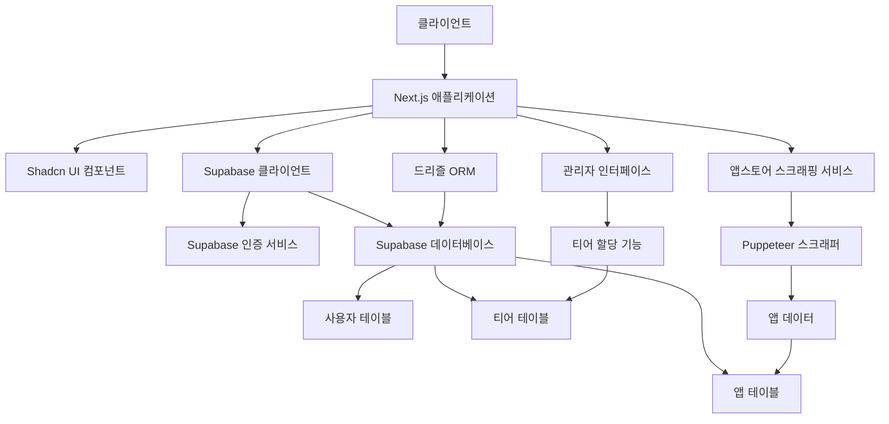

# 티어 기반 앱 순위 서비스 스펙 문서

## 개요

앱스토어 앱들을 티어 시스템(1티어, 2티어, 3티어, 티어 없음)으로 분류하는 웹 서비스입니다. 관리자가 앱에 티어를 할당하고, 사용자는 티어별로 앱을 탐색할 수 있습니다.

## 시스템 아키텍처

### 주요 구성 요소

1. **클라이언트**(웹 브라우저)

   - Shadcn UI 컴포넌트를 사용한 현대적 인터페이스
   - 반응형 디자인으로 모바일/데스크톱 모두 지원

2. **Next.js 애플리케이션**

   - 서버 측 렌더링 및 API 라우팅
   - 정적 생성 및 동적 라우팅 지원

3. **Shadcn UI 컴포넌트**

   - 버튼, 카드, 테이블, 모달 등 UI 요소
   - 메인 티어 페이지 디자인 핵심 구성 요소

4. **Supabase**

   - **인증 서비스**: JWT 기반 사용자 인증
   - **실시간 데이터베이스**: PostgreSQL 기반 데이터 저장

5. **드리즐 ORM**

   - 데이터베이스 스키마 정의 및 관리
   - 쿼리 생성 및 마이그레이션 처리

6. **앱스토어 스크래핑 서비스**

   - Puppeteer를 사용한 웹 스크래핑
   - 앱스토어에서 앱 메타데이터 수집
   - 수집된 데이터 자동 데이터베이스에 저장

7. **관리자 인터페이스**
   - 티어 할당 기능
   - 앱 목록 표시 및 필터링
   - 관리자 권한 인증

### 아키텍처 다이어그램 (Mermaid)

## 데이터베이스 스키마

### 테이블 구조

#### 사용자 테이블 (`users`)

| 컬럼명     | 타입        | 설명               |
| ---------- | ----------- | ------------------ |
| id         | `uuid`      | 고유 식별자        |
| email      | `text`      | 이메일 주소        |
| created_at | `timestamp` | 계정 생성 시점     |
| updated_at | `timestamp` | 최근 업데이트 시점 |
| is_admin   | `boolean`   | 관리자 권한 플래그 |

#### 앱 테이블 (`apps`)

| 컬럼명       | 타입        | 설명                 |
| ------------ | ----------- | -------------------- |
| id           | `uuid`      | 고유 식별자          |
| app_store_id | `text`      | 앱스토어 고유 식별자 |
| name         | `text`      | 앱 이름              |
| description  | `text`      | 앱 설명              |
| icon_url     | `text`      | 앱 아이콘 URL        |
| created_at   | `timestamp` | 등록 시점            |
| updated_at   | `timestamp` | 최근 업데이트 시점   |

#### 티어 테이블 (`tiers`)

| 컬럼명      | 타입        | 설명                   |
| ----------- | ----------- | ---------------------- |
| id          | `uuid`      | 고유 식별자            |
| app_id      | `uuid`      | 앱 테이블 외래 키      |
| assigned_by | `uuid`      | 사용자 테이블 외래 키  |
| tier        | `integer`   | 티어 레벨 (1, 2, 3, 0) |
| assigned_at | `timestamp` | 할당 시점              |
| notes       | `text`      | 관리자 비고            |

### 관계 구조

- `apps` ↔ `tiers`: 한 앱에 여러 티어 할당 가능 (역사 추적)
- `users` ↔ `tiers`: 관리자만 티어 할당 가능 (`is_admin=true`)

## 사용자 역할

### 일반 사용자

- 티어별 앱 목록 탐색
- 앱 상세 정보 확인
- 계정 관리(로그인/로그아웃)

### 관리자

- 앱 목록 관리
- 티어 할당 및 수정
- 스크래핑 작업 시작
- 사용자 관리(관리자 권한 부여)

## 주요 기능

1. **사용자 인증**

   - 이메일/비밀번호 기반 가입 및 로그인
   - 소셜 로그인(구글, 애플) 옵션

2. **앱 목록 표시**

   - 티어별 필터링(1티어, 2티어, 3티어, 티어 없음)
   - 검색 및 정렬 기능
   - 앱 카드에 아이콘, 이름, 설명 표시

3. **티어 할당**

   - 관리자 전용 인터페이스
   - 앱 선택 후 티어 선택
   - 할당 사유 입력 필드

4. **앱스토어 스크래핑**

   - Puppeteer를 사용한 자동화된 스크래핑
   - 주기적 업데이트(예: 매일 오전 1시)
   - 스크래핑 실패 시 로깅 및 알림

5. **관리자 대시보드**
   - 티어 할당 현황
   - 스크래핑 작업 상태
   - 사용자 활동 로그

## 기술 스택

- **프레임워크**: Next.js 14+
- **타입 시스템**: TypeScript
- **UI 라이브러리**: Shadcn UI + Tailwind CSS
- **인증**: Supabase Auth
- **데이터베이스**: PostgreSQL (Supabase)
- **ORM**: Drizzle ORM
- **스크래핑**: Puppeteer
- **배포**: Vercel(프론트엔드) + Supabase(백엔드)
- **관리**: GitHub Actions( CI/CD )

## 비고

- 모든 텍스트는 한국어로 표시
- 관리자 권한은 데이터베이스 `users.is_admin` 필드로 관리
- 티어 할당은 역사 추적을 위해 여러 레코드로 저장
- 스크래핑 서비스는 서버 측에서 실행
